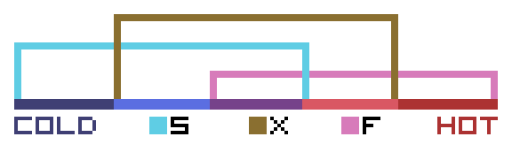

# PlanetXploit's Design Doc

## Overview

PlanetXploit is an idle game focused on gathering resources with moderated user interaction.

## Views

* **[Universe view]**. An icon will be shown at the planet where the player currently is.
* **[Planet view]**. Current visited planet view.
* **[Buildings view]**. Buildings present in current planet. The player can check how much **[RPS]** a specific building type is providing, for each unit and the whole pack of bought buildings of that type. 
* **[Research view]**. The player can **[research]** tech to discover and upgrade **[buildings]** among other upgrades like reducing **[travel]** cost in **[xargon]**.
* **[Stats view]**. The player can view its stats.

## Resource types

Resources in planets are infinite. The only thing that changes is the rate at which the player gather them. The player can find the following resource types:

* **[Froncetite]** - Rare, gas.
  * Used to build **[froncetite]** and **[xargon]** gathering buildings
* **[Sandetite]** - Rare, solid.
  * Used to build **[sandetite]** and **[xargon]** gathering buildings
* **[Xargon]** - Common, liquid.
  * Used to build **[froncetite]**, **[sandetite]** and **[xargon]** gathering buildings

The way resources can be found in planets follow the next diagram:

As a bonus, gas-based planets could have an increased probability of generating bigger quantities of **[froncetite]**, and the same with solid-based planets and **[sandetite]**.

With a specific type of **[buildings]**, **[froncetite]** and **[sandetite]** can be converted into **[xargon]**. Otherwise, the player could get stuck in a planet, because **[xargon]** is used as fuel to **[travel]** between planets.

## Planets

Planet properties:

* **[Base gathering rate]** for each resource kind.
* **[Temperature]** - Influences present resources.
* **[State]** - Gas or solid. Influences present resources.
* **[Size]** - Influences number of buildings?

## Storaging

There are two storage types:

* **[Planet storage]**
* **[Player storage]**

Each planet has its own material storage. When the player is not present in a planet but there are gatherers in it, resources will be stored in the planet storage, and not directly given to the player. These resources are moved to the player storage by visiting the planet.

## Player actions

* In **[planet view]**
  * Click on the planet to **[gather]** resources into **[player storage]**.
  * Click on icon at top right to go to **[universe view]**.
  * Click on icons at bottom to construct **[buildings]**.

* In **[universe view]**
  * Click on a planet opens a contextual menu:
    * **[Travel]** - Only active if the player has enough **[xargon]** to travel.
    * **[Visit]** - Go to **[planet view]**.
    * **[Info]** - Checks general information about the planet.

## Player mobility

The player needs a certain amount of **[xargon]** to travel between planets. The traveling time and **[xargon]** needed depends on the distance. For the jam, this time will be reduced. If the player does not have any **[xargon]** available, then some resource converting will be needed. The only resource needed to build a converter is the resource that it will convert from to **[xargon]**, because otherwise the player could get stuck in a planet.

**Possible upgrade:** require more **[xargon]** depending on how much resources the player have.

## Buildings

* **[Gatherer]**. 3 (by now) for each resource. Each one is much better than the previous one at gathering resources.
* **[Container]**. To store resources in a planet. If containers are full, **[gatherers]** won't collect any material until the player has traveled to the planet and fetched the resources.
* **[Converters]**. For non-**[xargon]** materials, to turn them into **[xargon]**.
* Power plant?? maybe too much.

# Note: some features are optional
